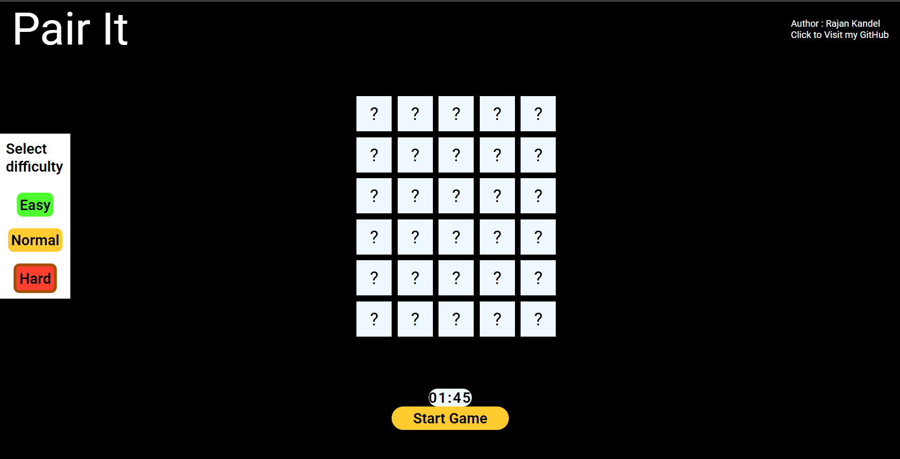
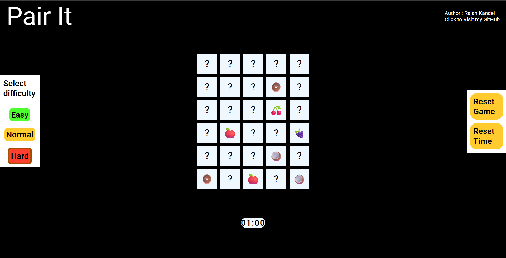

# RUNNER-CAT

Pair it is a food pairing game where you pair same emojies and player have to pair all same emojies under a cretian time period.

Pair it has three levels each with different grids and time periodds to pair the emojies. Easy and Normal level has 60sec i.e. 1min time and Hard mode has 105 i.e. 1min 45 sec to pair the emojies.

Pair it also has a reset button which resets the game and let you start from the begining as well as  a reset time button to reset the time to initial time if you feel like cheating or you are unable to compleate the level.

---
<!-- 
## Theme
Run Bro is a Endless theme game.

The game never reaches its end unless the user gets bumped into a obstacles.

Therefore a user can make endless score in the game by constantly avoiding the obstacles

--- -->

## Features

- Three different difficulties
- Timer to compleate the pairing
- Reset button to reset the game
- Reset time button to change the time to initial
- Responsive design 
- Offline playable(if you have the source code)

---

## Gameplay

- Choose a game difficulty(Easy,Normal,Hard)
- Click start button on the bottom of the screen to start playing
- click the cells to display the hidden emoji and try to pair it with the same emoji on another cell
- Use Reset time button to reset the time if you feel you cant compleate the level in given time
- Use Reset game button to Start a new game

---

## Technologies Used
- HTML5 
- CSS3
- JavaScript
- LocalStorage

---

## Author 

**Rajan Kandel**

GitHub: https://github.com/Rajandevs